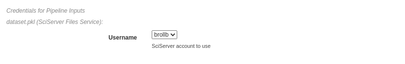
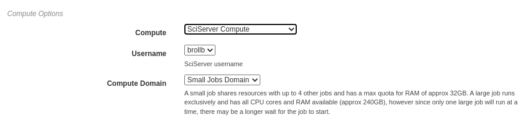
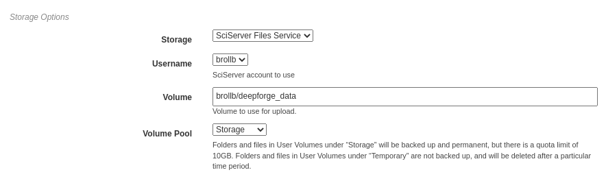

Executing Pipelines
-------------------

This page will guide you through the steps needed to execute a finished pipeline.

Executing within DeepForge
~~~~~~~~~~~~~~~~~~~~~~~~~~
Finished pipelines can be conveniently executed from within DeepForge. To do so, navigate to the desired pipeline's workspace, hover over the red + button in the bottom right, and click on the blue arrow button. This will open a dialog box for defining how to execute the pipeline. The configuration options are split into several sections. Once all information has been provided, clicking the blue *Run* button will begin execution. The information provided can also be saved for future executions by checking the box in the bottom left.

.. figure:: images/cifar-execute-dialog.png
    :align: center
    :scale: 50%

Basic Options
^^^^^^^^^^^^^
Here you will define the name of the execution. Execution names are unique identifiers and cannot be repeated. In the case that a name is given that has already been used for that project, an index will be added to the pipeline name automatically (i.e. *test* becomes *test_2*). Upon starting execution, the execution name will also be added to the project version history as a tag.

The pipeline can also be chosen to run in debug mode here. This will allow editing the operations and re-running the pipelines with the edited operations after creation. Alternatively, the execution will only use the version of each operation that existed when the pipeline was first executed. This can be helpful when creating and testing pipelines before deployment.

.. figure:: images/cifar-execute-basic.png
    :align: center
    :scale: 50%

Credentials for Pipeline Inputs
^^^^^^^^^^^^^^^^^^^^^^^^^^^^^^^
Pipeline inputs may be stored in different storage backends, such as S3 or SciServer Files, which may in turn require authorization for access. If authorization is required, this section of the dialog will be populated with input fields for the expected credentials. If no input artifacts are used in the pipeline, this section will not be present.

In the figure below, the pipeline inputs are stored using SciServer Files so a dropdown containing the linked SciServer accounts is shown.

Compute Options
^^^^^^^^^^^^^^^
In this section, you will select from the available compute backends.  Each compute backend may require additional information, such as login credentials or computation resources that should be used.

In the figure below, SciServer Compute is selected. SciServer Compute requires the user to select a linked account and a compute domain; this example is using the account, brollb, on the "Small Jobs Domain".

Storage Options
^^^^^^^^^^^^^^^
Here, the storage backend must be chosen from the available options. Each backend may require additional input, such as login credentials and the desired storage location. This storage backend and location will be where all files created during execution will be stored. This will include both files used during execution, such as data passed between operations, as well as artifacts created from Output operations.

The figure below shows an example using SciServer Files. Like SciServer Compute, the user must first select the linked account to use. Then the user must provide the volume and volume pool to be used. In this example, the "brollb" account is used with the "brollb/deepforge_data" volume on the "Storage" volume pool. More information can be found in the `SciServer User Guide <https://www.sciserver.org/wp-content/uploads/2021/09/sciserver-how-to-2021-09-22.pdf>`_.

Export Pipeline
~~~~~~~~~~~~~~~
If desired, pipelines can be exported as a command line utility for execution locally. Hovering over the red + icon in the pipeline's workspace and clicking the yellow export button that appears will open a dialog box for exporting the pipeline.

.. figure:: images/export-pipeline.png
    :align: center
    :scale: 50%

The dialog will prompt the user to select which of the pipeline inputs should be treated as *static artifacts*. A static artifact is an input of the pipeline that should be fixed to the current value. For example, if you have an evaluation pipeline which accepts two inputs, testing data and a model, you may want to set the model as a static artifact to export a pipeline which allows you to easily evaluate the model on other datasets. Alternatively, setting the testing data as a static artifact would allow you to evaluate different models on the same data. Any static artifacts will require the login credentials for the backend and account where the artifact is stored so it can be retrieved and bundled in the exported zip archive.

Clicking the blue *Run* button in the bottom right will generate the execution files for the pipeline and automatically download them in a zip file. In this zip folder are all the files normally generated for execution. The simplest way to execute this pipeline is to run the top-level *main.py* file. 

.. figure:: images/export-pipeline-dialog.png
    :align: center
    :scale: 50%
